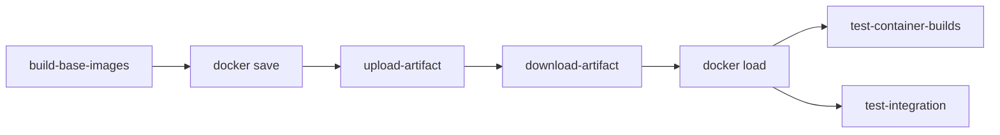

# GitHub Actions Artifacts Solution for Docker Image Sharing

## Problem Solved
The previous approaches using Docker Buildx isolation and GitHub Container Registry were complex and unreliable. Using GitHub Actions artifacts provides a simple, reliable way to share Docker images between jobs.

## New Architecture



## Key Changes

### 1. Build Base Images Job
**Before:** Push to GHCR registry
```yaml
- name: Build and push base image
  run: |
    docker buildx build --tag ghcr.io/... --push ...
```

**After:** Save as artifacts
```yaml
- name: Build base image
  run: |
    docker buildx build --tag gs_crawler/${{ matrix.image }}:test --load ...

- name: Save base image as artifact
  run: |
    docker save gs_crawler/${{ matrix.image }}:test > base_image_${{ matrix.image }}.tar

- name: Upload base image artifact
  uses: actions/upload-artifact@v4
  with:
    name: base-image-${{ matrix.image }}
    path: base_image_${{ matrix.image }}.tar
    retention-days: 1
```

### 2. Test Jobs
**Before:** Complex GHCR pull/fallback logic
```yaml
- name: Prepare base images
  run: |
    if docker pull "$ghcr_image" 2>/dev/null; then
      docker tag "$ghcr_image" "$local_tag"
    else
      # Complex fallback build logic...
    fi
```

**After:** Simple artifact download and load
```yaml
- name: Download base image artifacts
  uses: actions/download-artifact@v4
  with:
    pattern: base-image-*
    path: ./artifacts
    merge-multiple: true

- name: Load base images from artifacts
  run: |
    for artifact in ./artifacts/base_image_*.tar; do
      if [ -f "$artifact" ]; then
        docker load < "$artifact"
      fi
    done
```

## Benefits

### ✅ **Simplicity**
- No registry authentication needed
- No complex pull/fallback logic
- Standard Docker save/load commands

### ✅ **Reliability** 
- Artifacts are guaranteed to be available between jobs
- No network dependencies during image loading
- No registry rate limiting or authentication issues

### ✅ **Performance**
- Faster than registry push/pull
- Efficient artifact compression by GitHub
- Parallel artifact downloads

### ✅ **Security**
- No external registry access required
- Images stay within GitHub Actions environment
- No registry credentials management

### ✅ **Cost Efficiency**
- No registry storage costs
- Automatic cleanup after 1 day
- No bandwidth costs for image transfers

## Implementation Details

### Artifact Naming
- Pattern: `base-image-{image_name}`
- Files: `base_image_{image_name}.tar`
- Retention: 1 day (sufficient for PR workflows)

### Loading Strategy
- Download all base image artifacts at once
- Load all available images upfront
- Verify required images are available before building

### Error Handling
- Graceful handling of missing artifacts
- Clear error messages for debugging
- Verification steps to ensure images loaded correctly

## Workflow Impact

### Removed Complexity
- ❌ GHCR authentication and permissions
- ❌ Repository owner case conversion
- ❌ Registry URL management
- ❌ Network-dependent pull operations
- ❌ Complex fallback build logic

### Added Simplicity
- ✅ Standard Docker save/load operations
- ✅ Built-in GitHub Actions artifact system
- ✅ Automatic artifact lifecycle management
- ✅ Simple verification and debugging

This approach eliminates all the registry-related complexity while providing a more reliable and faster solution for sharing Docker images between GitHub Actions jobs.
