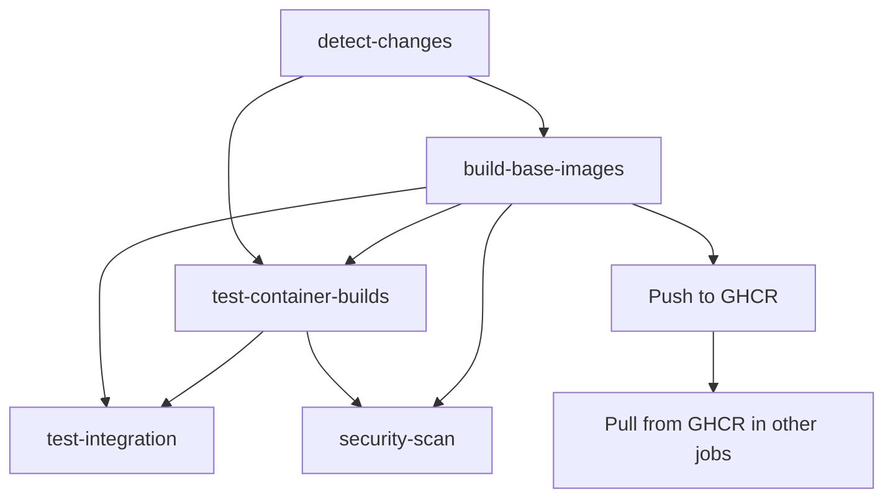

# GitHub Actions Workflow - Base Image Sharing Fix

## Problem
The original workflow had an issue where base images built in the `build-base-images` job were not available in the `test-container-builds` job, because each job creates a new Docker Buildx instance that doesn't share the local Docker image cache.

## Solution
Implemented a registry-based image sharing mechanism using GitHub Container Registry (GHCR):

### Key Changes

1. **Enhanced build-base-images job**:
   - Always pushes built base images to GHCR with tag `pr-<number>` or `test`
   - Uses `--push` flag to ensure images are available in registry
   - Runs when base images change OR any containers change (ensuring images are available when needed)

2. **Improved test-container-builds job**:
   - Updated "Prepare base images" step to first try pulling from GHCR
   - Falls back to local build with GitHub Actions cache if GHCR pull fails
   - Simplified logic with cleaner error handling
   - Maps base image names to GHCR image names consistently

3. **Updated integration and security jobs**:
   - Added `build-base-images` to job dependencies
   - Updated integration job to use same GHCR pull logic
   - Ensures all jobs can access pre-built base images

### Workflow Logic

### Image Sharing Strategy

1. **When base images changed**: 
   - `build-base-images` builds and pushes to GHCR
   - All other jobs pull from GHCR first

2. **When only containers changed**:
   - `build-base-images` still runs to ensure images are available
   - Other jobs try GHCR first, fall back to cached build

3. **Cache utilization**:
   - GitHub Actions cache (`type=gha`) for faster builds
   - GHCR as inter-job image sharing mechanism

### Benefits

- ✅ **Reliable image sharing**: Images built in one job are available in others
- ✅ **Efficient caching**: Uses both GHA cache and GHCR registry
- ✅ **Fallback mechanism**: Graceful degradation if registry pull fails  
- ✅ **Simplified logic**: Cleaner, more maintainable code
- ✅ **Better error handling**: Clear error messages and proper cleanup

### Registry Tags

- **PR builds**: `ghcr.io/<owner>/gs_crawler_<base_image>:pr-<number>`
- **Manual/test builds**: `ghcr.io/<owner>/gs_crawler_<base_image>:test`
- **Local tags**: `gs_crawler/<base_image>:test` (consistent across jobs)

This solution ensures that Docker images built in the `build-base-images` job are properly shared and reused across all subsequent jobs in the workflow, eliminating the Docker Buildx isolation issue.
